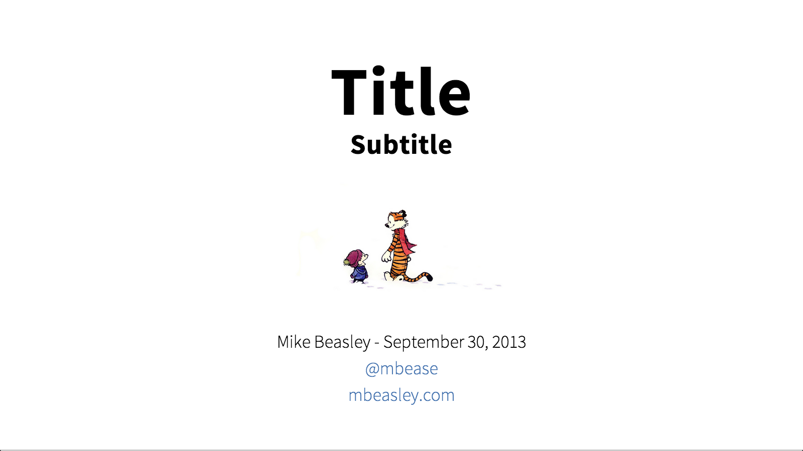
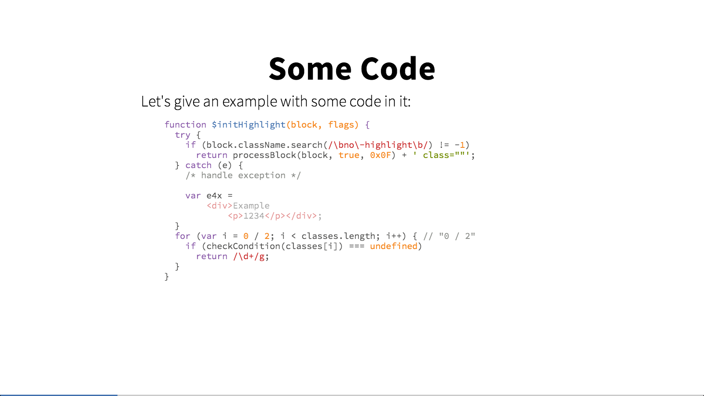
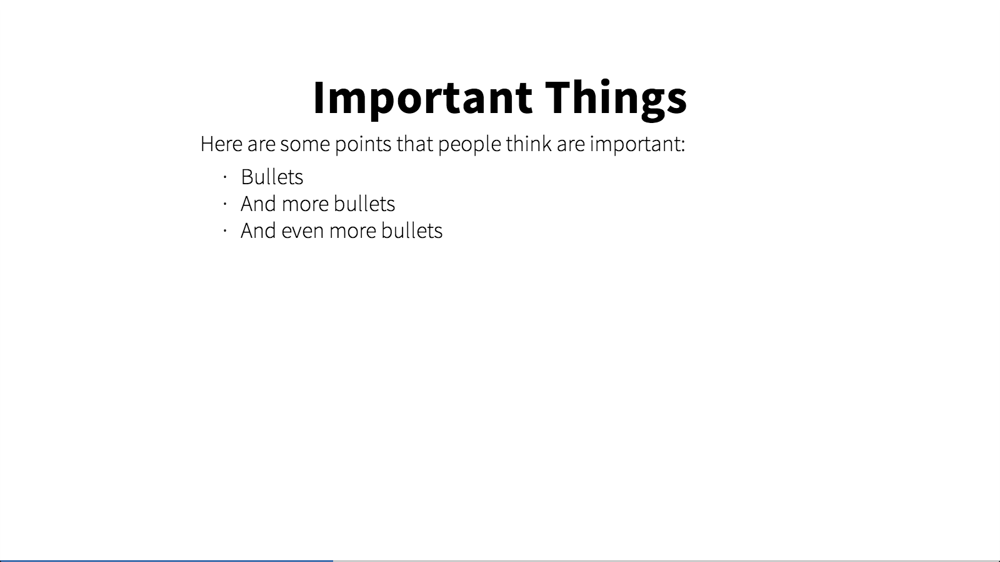

# reveal-minimal

[Installation](#installation) | [Suggested Settings](#settings) | [Screenshots](#screenshots)

This is a minimal theme for reveal.js.  Most of the frills are removed, using a simple black-on-white color scheme.  The rest of the color pallette, including the colors used for syntax highlighting, use the [Tomorrow](https://github.com/chriskempson/tomorrow-theme) theme.  The theme uses two fonts: [Source Sans Pro](https://www.google.com/fonts/specimen/Source+Sans+Pro) and [Source Code Pro](https://www.google.com/fonts/specimen/Source+Code+Pro).

### Installation
To use with reveal.js, copy the `minimal.scss` file to `css/theme/source/` directory and run `grunt themes` to compile the css.

Retrieve the [tomorrow.css](https://github.com/isagalaev/highlight.js/blob/master/src/styles/tomorrow.css) theme for highlight.js and move it to the `lib/css/` directory.

Finally, in your `index.html` file for your presentation, you will need to change the stylesheet links to:

    <link rel="stylesheet" href="css/theme/minimal.css" id="theme">

    <!-- For syntax highlighting -->
    <link rel="stylesheet" href="lib/css/tomorrow.css">

### Suggested Settings
I recommend using the following settings for the cleanest experience:

    controls: false,
    progress: true,
    history: true,
    center: false,
    backgroundTransition: 'none',
    theme: Reveal.getQueryHash().theme,
    transition: 'linear'

I also prefer to use a markdown file for my slides, so I replace the entire contents of the `
` element with:

    <section data-markdown="slides\slides.md" data-separator="^\n---\n\n" data-vertical="^\n--\n\n" data-notes="^Note:"></section>

You'll then need to create a `slides\slides.md` file and spereate each slide with (`↵` denotes an actual new line):

    ↵
    ---
    ↵

### Screenshots

Title Slide:

Syntax Highlighting:

Normal Slide:

